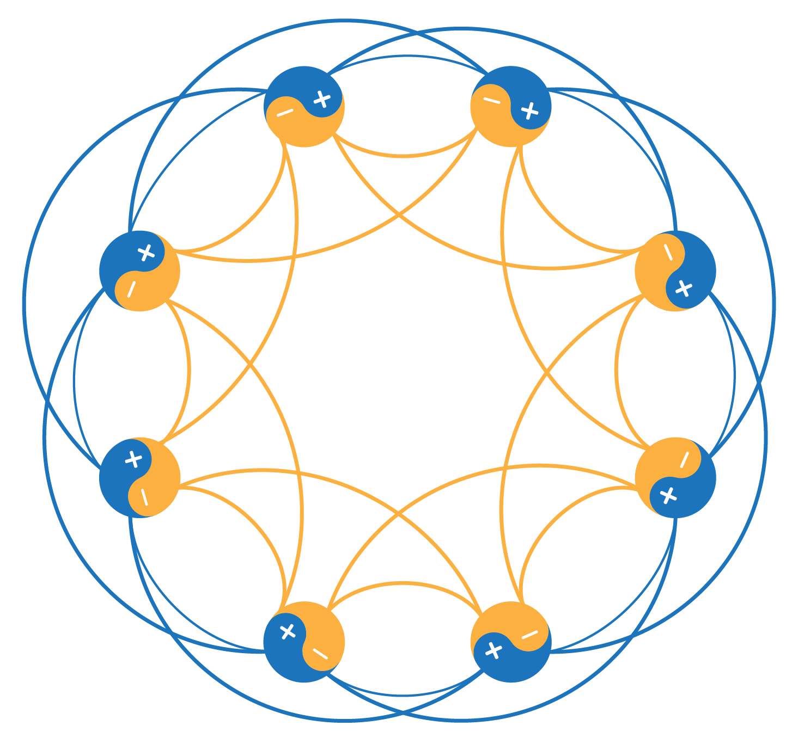

# Noise-shaped Synchrony in Neuronal Oscillator Networks

<p align="center">
  
</p>

---

## 📘 Description

This repository contains the **data** and **code** used to generate the figures and table presented in:

> *"Noise-shaped Synchrony in Neuronal Oscillator Networks"*  
> Submitted for publication to *Physical Review Letters (Phys. Rev. Lett.)*.

The work focuses on how **noise** influences synchrony patterns in **neuronal oscillator networks** modeled via the **FitzHugh–Nagumo (FHN)** equations.

---

## ⚙️ Recommended Usage

It is highly recommended to run this project inside a **Python virtual environment** to keep dependencies isolated.

### 🧩 Create and activate a virtual environment

```bash
# Create environment
python3 -m venv venv

# Activate environment (Linux/macOS)
source venv/bin/activate

# Activate environment (Windows)
venv\Scripts\activate
```

---

## 🧰 Installation Requirements

Alternatively, if you prefer a **system-wide installation**, you can use:

```bash
sudo apt install jupyterlab python3-notebook python3-jupyterlab-server jupyter-server
```

---

## 🚀 Getting Started

Launch **JupyterLab** to explore and reproduce the figures:

```bash
jupyter lab
```

Then, open the desired notebooks to visualize or modify the simulation results.

---

## 📂 Repository Structure

```
Noise_shaped_synchrony_FHN_network/
│
├── Figure_01/       # Scripts and data for Figure 01
├── Figure_02/       # Scripts and data for Figure 02
├── Figure_03/       # Scripts and data for Figure 03
├── Figure_04/       # Scripts and data for Figure 04
├── Table_01/        # Data table for results
│
├── LICENSE
└── README.md
```

---

## 📜 License

This project is distributed under the **MIT License**.  
See the [LICENSE](LICENSE) file for details.

---

<p align="center">
  <b>Created by MaxCL</b>
</p>
