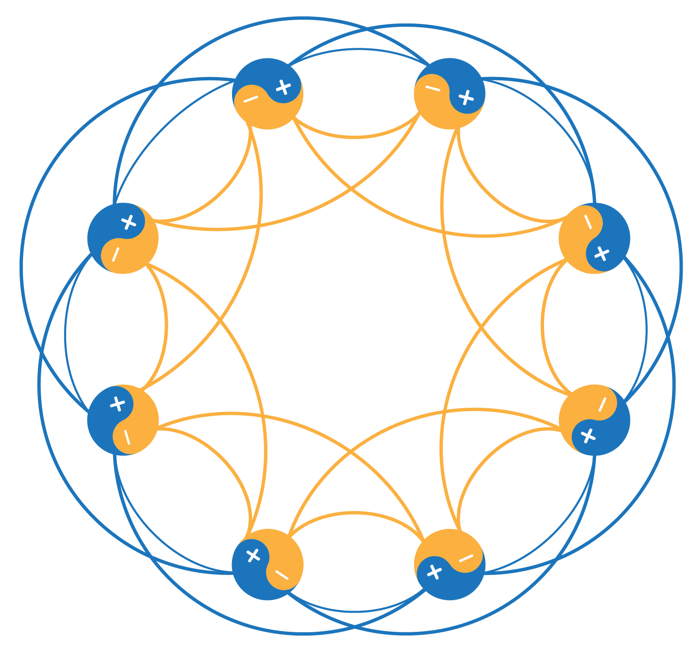

# Noise-shaped Synchrony in Neuronal Oscillator Networks

<p align="center">

</p>

------------------------------------------------------------------------

## Requirements

-   <b> Python **3.11** (required) </b>
-   `pip`
-   Recommended: virtual environment (`venv` or Conda)

> **Important:** The code has been tested with **Python 3.11**.\
> Earlier Python 3.x versions (e.g. 3.10) may fail to install some
> dependencies or run the notebooks correctly.

------------------------------------------------------------------------

## 📘 Description

This repository contains the **code** and **data** used to generate the
figures and table for:

> *"Noise-shaped Synchrony in Neuronal Oscillator Networks"*\
> Submitted for publication to *Physical Review E (Phys.
> Rev. E)*.

The project investigates how **noise shaping** affects synchrony in
**neuronal oscillator networks** modeled with the **FitzHugh--Nagumo
(FHN)** equations.

------------------------------------------------------------------------

## ⚙️ Recommended Usage

### Optional system dependency (LaTeX text rendering)

Some figures may be configured to use Matplotlib's LaTeX rendering
(`text.usetex=True`). If you see errors related to `texmanager`, install
a LaTeX distribution:

``` bash
sudo apt-get update
sudo apt-get install -y texlive-latex-extra texlive-fonts-recommended dvipng cm-super
```

This is system-wide installation. If you prefer not to install LaTeX,
disable it in your notebook or in `figures_lib.py`:

``` python
import matplotlib as mpl
mpl.rcParams["text.usetex"] = False
```

### Python environment

Run everything inside a **Python virtual environment** and install
dependencies from `requirements.txt`. This keeps your system clean and
ensures reproducibility.

------------------------------------------------------------------------

## 🧰 Installation

### ✅ Prerequisites

-   Python **3.11**
-   `pip`

### 🧩 Create and activate a virtual environment

``` bash
# Create environment (Linux/macOS)
python3.11 -m venv venv

# Activate environment (Linux/macOS)
source venv/bin/activate
```

On Windows (Command Prompt), use:

``` bat
:: Create environment (Windows)
py -3.11 -m venv venv

:: Activate environment (Windows)
venv\Scripts\activate
```

### 📦 Install dependencies

``` bash
python -m pip install --upgrade pip
pip install -r requirements.txt
```

------------------------------------------------------------------------

## 🚀 Getting Started

You can reproduce results either by running scripts or by using Jupyter.

### Option A --- Run jupyter and navigate

``` bash
jupyter-notebook
```

### Option B --- Run each notebook individually

``` bash
$jupyter-notebook Figure_01_FHN.ipynb
```

Open the notebooks or scripts inside the relevant `Figure_0X/` folders.

------------------------------------------------------------------------

## 📂 Repository Structure

    Noise_shaped_synchrony_FHN_network/
    │
    ├── Figure_01/           # Scripts/data to reproduce Figure 01
    ├── Figure_02/           # Scripts/data to reproduce Figure 02
    ├── Figure_03/           # Scripts/data to reproduce Figure 03
    ├── Figure_04/           # Scripts/data to reproduce Figure 04
    ├── Table_01/            # Scripts/data to reproduce Table 01
    │
    ├── figures/             # Shared/generated figure assets (if applicable)
    ├── figures_lib.py       # Shared plotting/helpers used across figures
    ├── split_noise.py       # Noise processing utility
    ├── extract_clean_noise.py
    ├── gen_csv_files.py     # Data export/helper utility
    │
    ├── figure1a.png         # Preview image for this README
    ├── requirements.txt    # Python dependencies (recommended install path)
    ├── LICENSE
    └── README.md

------------------------------------------------------------------------

## 🧪 Reproducibility Notes

-   Always activate the virtual environment before running any code.
-   If you encounter missing packages, re-run:

``` bash
pip install -r requirements.txt
```

-   Results may vary slightly across machines due to numerical and
    random-seed differences unless seeds and runtime parameters are
    explicitly fixed within each figure workflow.

------------------------------------------------------------------------

## 📜 License

This project is distributed under the **MIT License**.\
See the [LICENSE](LICENSE) file for details.

------------------------------------------------------------------------

<p align="center">
  <span style="color: #6a737d;"><b>Created by MaxCL</b></span>
</p>

